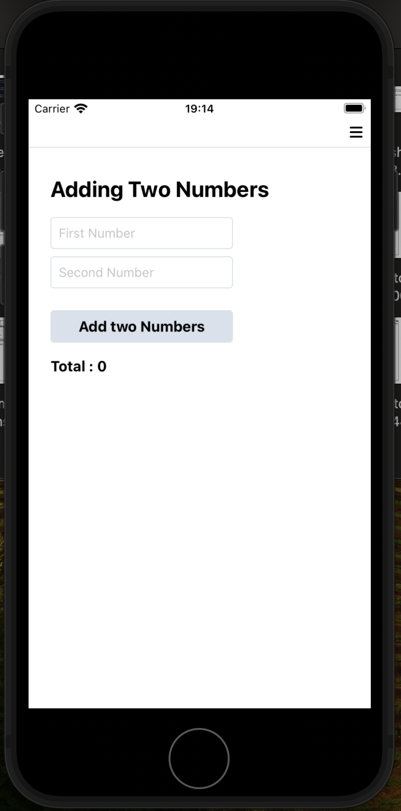
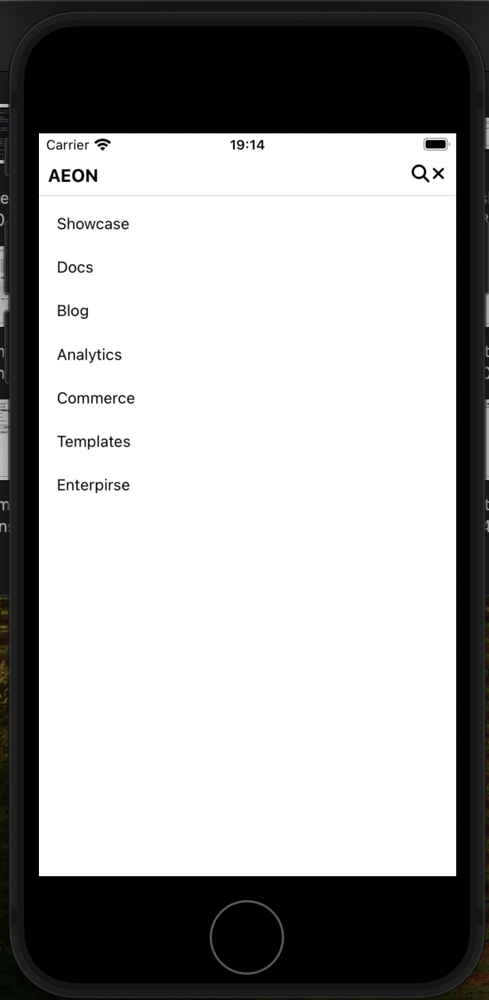
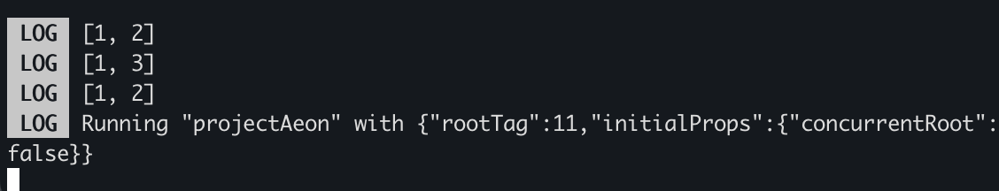

# Getting Started

>**Note**: Assaignment

## Step 1: Start the Metro Server

First, you will need to install node modules.

```bash
# using npm
npm install
```

Then, need to install pods, 

```bash
cd ios && pod install

```

## Step 2: Start Application

Go back to root and run below

```bash
# using npx
npx react-native run-ios
```

If everything is set up _correctly_, you should see your new app running in Simulator.

after app opens you can see calculator and Hamburg icon in screen.


once you click on Hamburg icon, Navigation bar will display.


for Challenge 3, you can check metro console and you can see result of below test

input: 
```bash
console.log(TwoSum([2, 7, 11, 15], 9));
console.log(TwoSum([2, 3, 4], 6));
console.log(TwoSum([-1, 0], -1));
```
output : 

